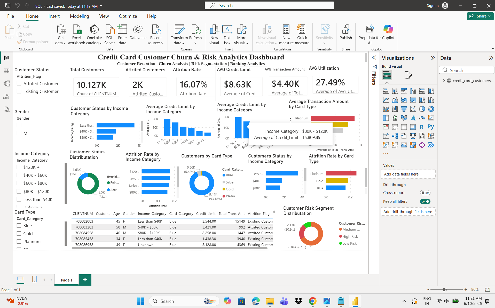

# Credit Card Customer Churn & Risk Analytics Dashboard

## Project Overview

This project analyzes customer churn behavior, customer segmentation, credit utilization, transaction activity, and risk distribution using SQL and Power BI.

The objective is to identify customer attrition patterns and provide insights that can help financial institutions improve customer retention and portfolio performance.

## Tools Used

* SQL
* Power BI
* Microsoft Excel

## Dataset

The dataset contains customer banking information including:

* Customer Demographics
* Income Category
* Card Category
* Credit Limit
* Transaction Amount
* Utilization Ratio
* Attrition Status

## Key Performance Indicators (KPIs)

* Total Customers
* Attrited Customers
* Attrition Rate
* Average Credit Limit
* Average Transaction Amount
* Average Credit Utilization

## Dashboard Features

* Customer Churn Analysis
* Customer Retention Tracking
* Income Category Analysis
* Card Category Analysis
* Risk Segmentation
* Customer-Level Reporting

## Business Problem

Customer attrition can negatively impact profitability and customer lifetime value. Financial institutions need to understand which customers are at risk of leaving and identify factors contributing to churn.

This dashboard helps analyze customer behavior and supports data-driven retention strategies.

## Key Insights

* Attrition rates vary across customer segments.
* Credit utilization patterns help identify high-risk customers.
* Income categories influence customer spending behavior.
* Card category analysis reveals differences in customer value and retention.

## Skills Demonstrated

* SQL Query Development
* Customer Analytics
* Churn Analysis
* Risk Analytics
* KPI Reporting
* Data Visualization
* Power BI Dashboard Development

## Dashboard Screenshot

